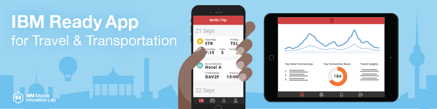

# Ready App for Travel & Transporation

## Overview

IBM Ready App for Travel & Transportation delivers a seamless travel experience by guiding the user through the transitional stages of travel. Customer engagement is maximized by providing a best in class travel management system offering personalized and contextual information at the right time. 

The T&T Ready App accentuates the entire journey by:

* Proactively reacting to travel changes in real time.
* Subtly offering deals targeting customers’ personality and context.
* Providing deep customer insight into the rail traveler’s journey.
* Showcasing rail travel as the central hub of a travel management system integrating internal and external data sources.

## Getting Started

Please visit the [Getting Started page](http://lexdcy040194.ecloud.edst.ibm.com/travel_1_0_0/getting_started) to set up the project.

## Documentation

Please visit [this page](http://lexdcy040194.ecloud.edst.ibm.com/travel_1_0_0/home) for access to the full documentation.

## Project Structure

* `/iOS`        directory for the iOS client.
* `/liberty`     
* `/RemyLiberty` 
* `/travel-businessrules`
* `/travel-businessrules-app`
* `/travel-businessrules-deployment`
* `/travel-java-common`
* `/Travel-mfpf`    

## License

IBM Ready App for Travel & Transportation is available under the IBM Ready Apps License Agreement. See the [License file](https://github.com/IBM-MIL/IBM-Ready-App-for-Travel/blob/master/License.txt) for more details.