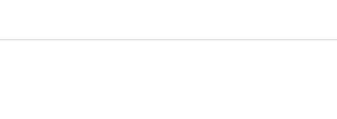

MILAlertView
=======================

MILAlertView is a simple to use, minimal setup, reusable UI component built in Swift to display a __customizable alert banner__. It features two beautifully animated styles available out of the box:

* __Classic__ - Standard banner notification with reload button to optionally execute a callback method (such as retry connection). Tapping anywhere on the MILAlertView will also execute the callback method. Offers customizable text, text color, font, background color, time to stay shown before hiding, and reload button image.
	

	
* __FakeMessage__ - Fake Message banner to resemble the look and feel of Apple's iMessage banner. Tapping anywhere on the MILAlertView can optionally execute a callback method. Offers customizable text, text color, font, background color, and time to stay shown before hiding.

## Installation

Simply copy the `MILAlertView` folder into your Xcode project.

## Usage

Open `MILAlertViewExample.xcodeproj` within the `MILAlertViewExample` folder to see an example in context. In particular, `ViewController.swift` shows a simple implementations of both Classic and FakeMessage MILAlertView styles.

1. To start using MILAlertView in your project, open the View Controller in which you would like to display an MILAlertView. If using the FakeMessage style, you may want to hide the status bar of that View Controller to achieve the most realistic appearance.
	
1. Simply show an MILAlertView with the style of your choice by calling `MILAlertView.sharedInstance.show()`. At a minimum, you must specify the required parameters `alertType`, `text`, and `callback` within the `show()` method as shown in the one line below.

        MILAlertViewManager.sharedInstance.show(.Classic, text: "MILAlertView Test!", callback: tappedAlert)
        
	And that's it! The code above animates a Classic MILAlertView banner with a callback method `tappedAlert()` inside the View Controller, which will be called when the user taps either the banner or the reload button. Once tapped, the MILAlertView hides with a smooth animation.

1. Optionally, you can customize values for the other optional parameters in the `show()` method. Reference the table in the section below for parameter details and default values. The code to display the Classic MILAlertView shown in the first animated `.gif` at the top of this page is shown below.

        MILAlertViewManager.sharedInstance.show(.Classic,
        										text: "MILAlertView Test!", 
        										backgroundColor: UIColor.purpleColor(), 
        										inView: self.view, 
        										toHeight: 44, 
        										callback: tappedAlert)
        
1. Hiding an MILAlertView programmatically with a beautiful animation is simple. Put the following line where you would like to hide the MILAlertView (of any style).

        MILAlertViewManager.sharedInstance.hide()

1. One parameter to note is the required `callback` parameter. You may set this to nil, which hides the reload button on the Classic MILAlertView style, but has no effect on the appearance of the FakeMessage style. For both styles, if `callback` is set to nil, the MILAlertView will stay shown until the user taps any part of the MILAlertView or calls `MILAlertViewManager.sharedInstance.hide()`. If you would like the MILAlertView to simply show and hide automatically on a timer, set `callback` to nil, and set the `forSeconds` parameter as shown below.
        
        MILAlertViewManager.sharedInstance.show(.FakeMessage, text: "MILAlertView Test!", forSeconds: 2, callback: nil)
        
	The line above animates a FakeMessage style banner (with no callback method) which shows for 2 seconds then hides, as shown in the second animated `.gif` at the top of this page.
	
## Customizable Parameters
The complete `show()` method has several parameters, many of which are optional to specify. Details of each parameter are given below. For even finer customization of your MILAlertView, you can modify `MILAlertView.xib` and `MILFakeMessageBannerView.xib` within the `Views` folder of `MILBannerView`, but this shouldn't be necessary in most cases.

	MILBannerViewManager.SharedInstance.show(alertType: MILAlertView.AlertType!, 
											text: String!, 
											textColor: UIColor?, 
											textFont: UIFont?, 
											backgroundColor: UIColor?, 
											reloadImage: UIImage?, 
											inView: UIView?, 
											underView: UIView?, 
											toHeight: CGFloat?, 
											forSeconds: NSTimeInterval?, 
											callback: (()->())!)

<table>
  <caption>Parameter Descriptions</caption>
  <tr>
    <td><tt>alertType: MILAlertView.AlertType!</tt><b>(Required)</b></td>
    <td>AlertType of MILAlertView to display -- value can be either .Classic or .FakeMessage. If nil, default alertType is .Classic</td>
  </tr>
  <tr>
    <td><tt>text: String!</tt><b>(Required)</b></td>
    <td>Body text to display on the MILAlertView. If nil, default text is "MILAlertView" as set in the respective .xib</td>
  </tr>
  <tr>
    <td><tt>textColor: UIColor?</tt></td>
    <td>Color of body text to display. If nil or not set, default is as set in the respective .xib</td>
  </tr>
  <tr>
    <td><tt>textFont: UIFont?</tt></td>
    <td>Font of body text to display. If nil or not set, default is as set in the respective .xib</td>
  </tr>
  <tr>
    <td><tt>backgroundColor: UIColor?</tt></td>
    <td>Background color of the MILAlertView. If nil or not set, default is as set in the respective .xib</td>
  </tr>
    <tr>
    <td><tt>reloadImage: UIImage?</tt></td>
    <td>Reload button image (MILAlertView .Classic style only with a non-nil callback). If callback is nil, reloadButton will be hidden regardless of reloadImage. If reloadImage is nil or not set, default is as set in MILAlertView.xib</td>
  </tr>
  <tr>
    <td><tt>inView: UIView?</td>
    <td>View in which to add MILAlertView as a subview. If inView is nil or not set, alert is added to UIApplication.sharedApplication().keyWindow!</td>
  </tr>
  <tr>
    <td><tt>underView: UIView?</tt></td>
    <td>MILAlertView will be presented a layer beneath underView within inView. If underView is nil or not set, alert is added to the top of inView</td>
  </tr>
  <tr>
    <td><tt>toHeight: CGFloat?</tt></td>
    <td>Height of how far down the top of the MILAlertView will animate to when showing within inView. If toHeight is nil or not set, toHeight will default to 0 and alert will show at top of inView</td>
  </tr>
  <tr>
    <td><tt>forSeconds: NSTimeInterval?</tt></td>
    <td>NSTimeInterval (Double) for how many seconds the MILAlertView should stay shown before hiding, but only if callback is nil. If callback is nil, the alert will auto-hide after forSeconds seconds. If callback is not nil, forSeconds will be overwritten and the alert will not hide until tapped. If forSeconds is nil or not set (and callback is nil), the alert will also not hide until tapped</td>
  </tr>
    <tr>
    <td><tt>callback: (()->())!</tt><b>(Required)</b></td>
    <td>Callback method to execute when the MILAlertView or its reload button is tapped. If callback is nil, reloadButton will be hidden (and alert will hide on tap). Also, if callback is nil, forSeconds can be set to auto-show and auto-hide the alert after forSeconds seconds</td>
  </tr>
</table>

## Requirements
* Currently, MILAlertView is set up to work with iOS 8+
* It may take a small amount of adjustment to work on iOS 7

## Author

Created by [Nathan Hekman](https://github.com/nathan-hekman)
([Website](http://nathanhekman.com)) at the [IBM Mobile Innovation Lab](http://www-969.ibm.com/innovation/milab/)

